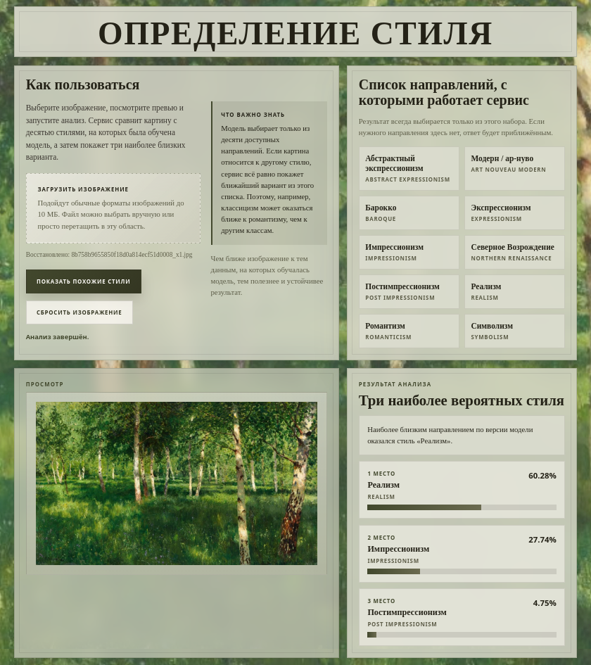

# Art Style Classifier

A compact FastAPI service that classifies paintings into 10 art styles and
returns the three most likely predictions from a fine-tuned Xception model.
It combines a model inference pipeline, a typed HTTP API, a simple browser
interface, and Docker packaging.

## Overview

The user selects or drops an image, reviews its preview, and receives the top
three predicted styles with confidence scores. The model compares the image
only with the 10 styles it was trained on, so the result should be read as the
closest matches within that set rather than a definitive attribution.

## Implementation

- **Model serving:** the Keras model is loaded once and reused across requests.
- **Inference contract:** input size, preprocessing function, model name, and
  class order are stored in `model/model_meta.json`.
- **API boundary:** FastAPI validates uploads and returns typed JSON responses
  with appropriate client, inference, and model-readiness errors.
- **Non-blocking request handling:** the synchronous CPU inference call runs in
  a worker thread through `asyncio.to_thread`, keeping the event loop available
  for lightweight I/O and health-check requests.
- **Deployment:** the API, browser interface, dependencies, metadata, and model
  artifact can be packaged into one Docker image.

```text
Browser -> FastAPI -> preprocessing -> Xception inference -> top-3 response
```

The generated API documentation is available at `/docs`, and `/health` reports
whether the model has been loaded successfully.

## Model

The preserved experiment uses a 60,565-image subset of WikiArt containing the
10 most represented styles. ResNet-50, EfficientNet-B0, and Xception were
trained with the same two-stage transfer-learning procedure. Xception produced
the strongest recorded results on the separate test directory and was selected
for the service.

| Metric | Recorded value |
|---|---:|
| Accuracy | 0.6064 |
| Top-3 accuracy | 0.8954 |
| Macro-F1 | 0.6196 |

Returning three results reflects the ambiguity between visually and
historically related styles better than a single label. The notebooks are kept
as a record of the completed experiment. See
[`research/README.md`](research/README.md) for dataset counts, the
validation-split caveat, Colab-specific paths, and Grad-CAM usage.

## Run locally

Download `Xception_production.keras` from the repository's
[Releases](https://github.com/mariveselo/art-style-classifier/releases) page and
place it in `model/`. The model binary is approximately 167 MB and is not
tracked in regular Git.

```bash
python -m venv .venv
source .venv/bin/activate
python -m pip install -r requirements.txt
python -m uvicorn app.main:app --host 127.0.0.1 --port 8000
```

Open <http://127.0.0.1:8000>. To run the inference smoke test:

```bash
python test_load.py
```

Alternatively, build and run the service with Docker after placing the model
artifact:

```bash
docker build -t art-style-classifier .
docker run --rm -p 8000:8000 art-style-classifier
```

## Limitations

- The classifier always selects the closest results from its fixed set of 10
  styles; it has no separate "not a painting" class.
- The service keeps one model in a single process and targets demonstration and
  low request volume rather than high-load inference.
- The training notebooks retain Colab and Google Drive paths because they
  document a completed experiment rather than a one-command training pipeline.

## Interface

<p align="center">
  
</p>
